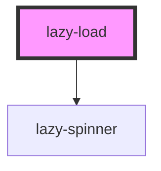

# my-component

<!-- Auto Generated Below -->

## Properties

| Property  | Attribute  | Description | Type     | Default     |
| --------- | ---------- | ----------- | -------- | ----------- |
| `altText` | `alt-text` |             | `string` | `undefined` |
| `imgSrc`  | `img-src`  |             | `string` | `undefined` |

## Dependencies

### Depends on

- [lazy-spinner](../lazy-spinner)

### Graph

----------------------------------------------

*Built with [StencilJS](https://stenciljs.com/)*
